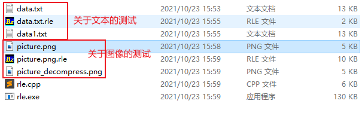
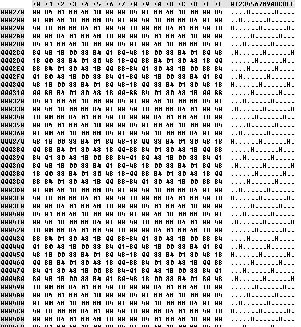

# DataCompression
&emsp;&emsp;使用C++实现大多数压缩算法，因为我的研究方向是数据压缩，而对于很多数据压缩算法我也只是知道其原理，但并不清楚如何实现，以至于在看一些重量级压缩算法时一筹莫展；因此，决定用C++实现/复现各类型的压缩算法；

&emsp;&emsp;在语言描述方面，如有引用他人文章，我会标明文章出处；在代码方面，如只用搬用其他作者代码，我也会标明来源；

&emsp;&emsp;如有代码格式不规范的问题，请见谅，这是初步版本，等我有能力有时间就完善成更好的；

# 游程编码

&emsp;&emsp;游程编码是一种比较简单的压缩算法，其基本思想是将重复且连续出现多次的字符使用（连续出现次数，某个字符）来描述;

&emsp;&emsp;比如一个字符串：`AAAAABBBBCCC` 使用游程编码可以将其描述为：`5A4B3C`；5A表示这个地方有5个连续的A，同理4B表示有4个连续的B，3C表示有3个连续的C，其它情况以此类推。原字符串需要12个字符才能描述，而使用游程编码压缩之后只需要6个字符就可以表示，还原回去的时候只需要将字符重复n次即可，这是个原理非常简单的算法；

&emsp;&emsp;那么在不同情况下这个编码的效果如何呢，假如采用定长1个字节来描述连续出现次数，并且一个字符占用1个字节，那么描述（连续出现次数，某个字符）需要的空间是2个字节，只要这个连续出现次数大于2就能够节省空间，比如AAA占用3个字节，编码为(3,A)占用两个字节，能够节省一个字节的空间，可以看出连续出现的次数越多压缩效果越好，节省的空间越大，对一个字符编码能够节省的空间等于=连续出现次数-2，于是就很容易推出连续出现次数等于2时占用空间不变，比如AA占用两个字节，编码为（2,A）仍然占用两个字节，白白浪费了对其编码的资源却没有达到节省空间的效果，还有更惨的情况，就是连续出现次数总是为1，这个时候会越压越大，比如A占用一个字节，编码为(1,A)占用两个字节，比原来多了一个字节，这种情况就很悲剧，一个1M的文件可能一下给压缩成了2M（真是效果奇佳啊），这是能够出现的最糟糕的情况，相当于在文件的每一个字节前面都插入了一个多余的字节0X01（这个字节表示连续出现次数为1），这种情况说明不适合使用游程编码，事实上，绝大多数数据的特征都属于第三种情况，不适合使用游程编码；

## 压缩和解压缩

&emsp;&emsp;最简单的实现，只能压缩英文字母，读取一个字符串，然后一直数出现了多少个连续字符，当重复被打断时就将上一个的重复字符和重复次数记一下，恢复时反之；

&emsp;&emsp;但是上面的不支持数字是个硬伤，为什么不支持数字呢，因为没办法区分一个数字究竟是表示连续出现次数的数字还是重复字符，这个是编码中经常出现的问题，一个很有效的方式是使**数据结构化**；看这个`100M22c6t`，表示连续出现次数的数字100占用三个字符，22占用两个字符，6占用1个字符，不是定长的啊，这个时候可以规定我的整个字符串可以从最开始按两个字符进行分组，每一组的第一个字符表示连续出现次数，第二个字符表示连续出现的字符，这样我按照位置区分数据的类型，就能够存储任意字符了；

&emsp;&emsp;总得来说，游程编码适合的场景是数据本身具有大量连续重复出现的内容，但在实际中使用起来比较困难，因为很难存在符合其压缩规范的数据集；

:rainbow_flag: 引用文章：[游程编码（Run Length Code） - CC11001100 - 博客园 (cnblogs.com)](https://www.cnblogs.com/cc11001100/p/9465806.html)

## 实现时遇到的问题

&emsp;&emsp;因为好久没用C++写大串代码，大部分时间都只是用来刷Leetcode，所以，很多地方都生疏了，这里记录一下，提醒自己也提醒读者；

### memset的使用

&emsp;&emsp;`void *memset(void *str, int c, size_t n)`：复制字符 **c**（一个无符号字符）到参数 **str** 所指向的字符串的前 **n** 个字符；

- **str** -- 指向要填充的内存块。
- **c** -- 要被设置的值。该值以 int 形式传递，但是函数在填充内存块时是使用该值的无符号字符形式。
- **n** -- 要被设置为该值的字符数。

### C++初始化字符串的几种方式

1. 直接赋值`string s="abc"`
2. `string( size_type length, char ch );`拷贝length个ch字符，`string str2( 5, 'c' );  //  str2 'ccccc'*`；
3. 用字符数组或者字符串：`string( string &str, size_type index, size_type length );`从`str[index]`开始的length个字符 或者 `string( string &str, size_type start, size_type end);`从`str[start]`到`str[end]`之间的字符； `string &str`可以变成`char *`;
4. 直接用字符数组的地址初始化也可以，默认该位置到结尾，`string(char *pos)`

### 关于C++的string是否以\0结尾

&emsp;&emsp;C++的string构造函数会在末尾自动添加一个'\0'，并且size和length函数都不计算'\0'的；C语言用`char*`指针作为字符串时，在读取字符串时需要一个特殊字符\0来标记指针的结束位置，也就是通常认为的字符串结束标记。

&emsp;&emsp;而c++语言则是面向对象的，长度信息直接被存储在了对象的成员中，读取字符串可以直接根据这个长度来读取，所以就没必要需要结束标记，而且结束标记也不利于读取字符串中夹杂\0字符的字符串；

### c++中string容量相关问题

&emsp;&emsp;在C++中，理解capacity和size之间的区别非常重要。容器的size是指它已经保存的元素的数目；而capacity则是在不分配新的内存空间的前提下它最多可以保存多少元素；

* capacity -> 容器能存储数据的个数；
* size = length -> 容器目前存在的元素个数；
* reserve -> 指定容器能存储数据的个数；
* resize -> 重新指定有效元素的个数；


&emsp;&emsp;当创建空容器时， 容量(capacity)为 0；当用完时，增加原容量的 1/2，这里可以理解为**以原大小的1.5倍另外配置一块较大的新空间，然后将原空间内容拷贝过来，在新空间的内容末尾添加元素，并释放原空间**；适用如 vector、string这种元素连续存储的容器， 如为list则不同；capacity一般大于size的原因是为了避免每次增加数据时都要重新分配内存，所以一般会生成一个较大的空间，以便随后的数据插入；

### 读写文件时，如果处理值>128的单字节

cpp能实现，c我觉得悬，读数据时先把它转换成`char*`地址，再转换成int，写的时候，用`char*`写入；

```cpp
fstream in(argv[0], ifstream::in | ios::binary);
if (!in)
	perror(argv[0]), exit(1);
// r->CompressFile(in, argv[1]);

// 依次读取二进制文件in中的unsigned char值,再写入out
unsigned char c;
fstream out("fir.txt", ios::trunc | ios::binary | ofstream::out);
while (in.read((char *)&c, sizeof(c)))
{
    cout << (int)c << endl;
    out.write((char *)&c, sizeof(c));
}
in.close();
out.close();
```

C也能实现，当时不知道，傻傻的用unsigned char去接受getc的值；

```cpp
void test(FILE *in)
{
    FILE *out = fopen("tarname.rle", "wb");
    int last = getc(in);
    int c = 0;
    int count = 1;
    while ((c = getc(in)) != EOF)
    {
        if (c == last && count < 255)
        {
            count++;
        }
        else
        {
            putc(count, out);
            putc(last, out);
            count = 1;
            last = c;
        }
    }
    putc(count, out);
    putc(last, out);
}
```


### 流操作 fstream

ios::app：　　　 //以追加的方式打开文件  
ios::ate：　　　 //文件打开后定位到文件尾，ios:app就包含有此属性  
ios::binary：　 //以二进制方式打开文件，缺省的方式是文本方式。两种方式的区别见前文  
ios::in：　　　  //文件以输入方式打开（文件数据输入到内存）  
ios::out：　　　 //文件以输出方式打开（内存数据输出到文件）  
ios::nocreate： //不建立文件，所以文件不存在时打开失败  
ios::noreplace：//不覆盖文件，所以打开文件时如果文件存在失败  
ios::trunc：　  //如果文件存在，把文件长度设为0

## 测试



为什么图像压缩后还会变大？



这是picture.png的二进制表示，很明显它连续重复的并不是一个字符，而是一串字符；需要别的压缩算法才能很好地压缩；

# 哈夫曼编码

实现哈夫曼编码的算法可分为两大部分：

1. 根据所给各个元素所占的权重值构造哈夫曼树；
2. 在哈夫曼树上求每个叶结点的编码；

